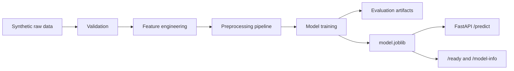

# Arquitetura

## Visao Geral

O projeto segue uma arquitetura modular para ciencia de dados aplicada a saude:

1. `scripts/generate_sample_data.py`: cria dados sinteticos sem informacao pessoal real.
2. `src/data`: carrega, valida e persiste datasets.
3. `src/features`: cria atributos derivados clinicamente interpretaveis.
4. `src/models`: treina, avalia, seleciona e persiste modelos.
5. `src/api`: expoe inferencia via FastAPI.
6. `src/utils`: logging, validacao e integridade de artefatos.
7. `tests`: valida componentes criticos.
8. `.github/workflows`: executa CI com treino e testes.

## Fluxo

## Separacao de Responsabilidades

- Dados e validacao ficam isolados de modelagem.
- Engenharia de atributos nao depende da API.
- A API carrega apenas artefato treinado e valida entrada.
- Metadados do modelo incluem versao, timestamp, metricas e hash SHA-256.
- Testes cobrem comportamento, nao detalhes internos frageis.

## Artefatos

Os artefatos gerados ficam em `artifacts/` e nao devem ser tratados como fonte de verdade clinica. Em producao, eles devem ser versionados em registry de modelos com trilha de auditoria.

## Endpoints

- `/health`: disponibilidade basica da aplicacao.
- `/ready`: verifica se o artefato de modelo esta carregavel.
- `/model-info`: expoe metadados nao sensiveis para operacao e auditoria.
- `/predict`: retorna probabilidade e classe de risco.
